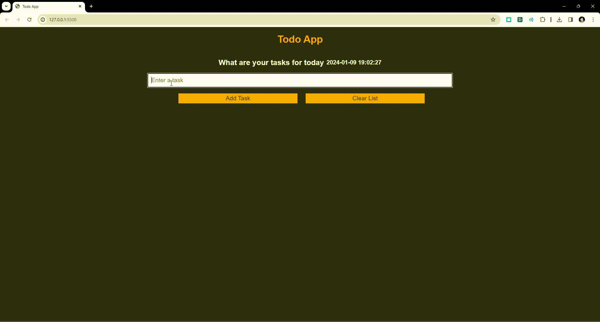

# Todo List Application

This is a simple, clean looking todo list application built with Vanilla JavaScript.
This application was created as a pass time to revisit the coding fundamentals that we so often forget

## Features

- Add tasks to the list
- Mark tasks as done
- Remove tasks from the list
- Clear the entire list
- Persist tasks in local storage so they're still there when you reload the page
- Display the current date and time, updated every second

## Installation
Just click on the link below

<a href="https://gdf-todo-list.vercel.app/" target="_blank">Vercel Deployment</a>

OR

1. Clone this repository.
2. Open `index.html` in your web browser.
3. Run `npm install` to install required dependencies

## How to Use

1. Enter a task in the input field.
2. Click the "Add Task" button or press Enter to add the task to the list.
3. Click the "Done" button next to a task to mark it as done.
4. Click the "Remove" button next to a task to remove it from the list.
5. Click the "Clear List" button to remove all tasks from the list.

## Dependencies

This project uses the following libraries:

- [Moment.js](https://momentjs.com/)
